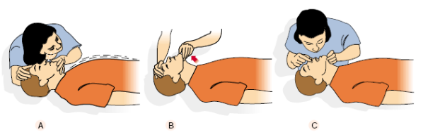
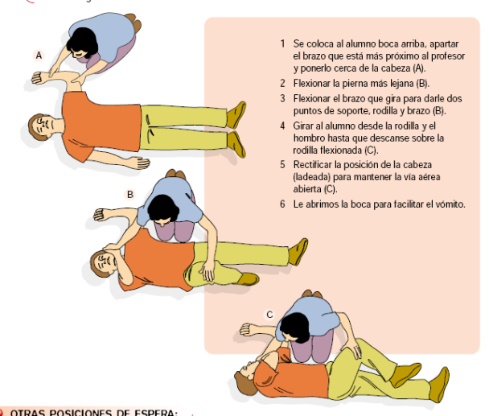
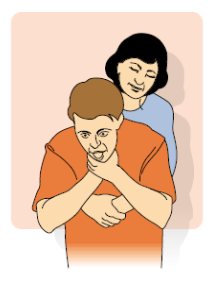

# 10. PROTOCOLO DE PRIMEROS AUXILIOS

**Texto adaptado del documento «Protocolos de actuación ante urgencias sanitarias en los centros educativos de Castilla y León» de la Junta de Castilla y León. Autoría citada en el documento original:**

Ana María Barbero Rodríguez. Pediatra de la Gerencia de Atención Primaria. Área Oeste. Valladolid.  
Marisa Vega Gutiérrez. Pediatra de la Gerencia de Atención Primaria. Área Este. Valladolid.  
Pilar Machín Acosta. Técnico de la Sección de Promoción de la Salud del Servicio Territorial de Sanidad y Bienestar Social de Valladolid.  
Silvia Tejero Encinas. Residente de Medicina Preventiva. Hospital Universitario “Río Hortega” de Valladolid.  
Susana Redondo Martín. Técnico del Servicio de Promoción de la Salud y Programas Preventivos de la Dirección General de Salud Pública y Consumo de la Consejería de Sanidad.  
Siro Lleras Muñoz. Jefe del Servicio de Programas Asistenciales de la Dirección Técnica de Atención Primaria.  Valladolid.  
Guillermo Doménech Muñiz. Jefe del Servicio de Promoción de la Salud y Programas Preventivos dela Dirección General de Salud Pública y Consumo de la Consejería de Sanidad.  

**NOTA TÉCNICA: Este es el texto histórico de los planes aportados. Algunas indicaciones clínicas, especialmente las relativas a RCP y obstrucción de vía aérea, requieren revisión conforme a guías sanitarias vigentes antes de utilizarse como protocolo operativo. Ante una emergencia sanitaria, llamar al 112 y seguir sus indicaciones.**

## PRINCIPIOS GENERALES

## ¿QUÉ SON? ¿EN QUÉ CONSISTEN?

Consisten en la prestación de asistencia a un accidentado o enfermo repentino.

Ante una situación de emergencia súbita con riesgo vital, está demostrado que la resolución del caso dependerá mucho de la primera respuesta sanitaria que se le dé.

ACTUACIÓN BÁSICA.

Proteger tanto al accidentado o enfermo como a uno mismo o a los demás.

Avisar al servicio de URGENCIAS 112 e informar del hecho con la mayor exactitud posible.

Socorrer, mientras tanto, atender al accidentado o herido:

TRANQUILIZARLO HABLANDO CON ÉL AUNQUE NO RESPONDA.

NO DESPLAZARLO NI MOVERLO.

PROCEDER A UNA EXPLORACIÓN PRIMARIA.

EXPLORACIÓN PRIMARIA.

Reconocimiento de los signos vitales (consciencia, respiración y pulso).

Exploración de la consciencia: preguntarle en voz alta: ¿qué te pasa?, ¿me oyes? Si contesta, seguro que mantiene constantes vitales. Si no contesta, ni responde a estímulos, llamar a URGENCIAS 112 inmediatamente, sin tocarlo ni moverlo, comprobando su respiración.

Exploración de la respiración: acercar nuestra mejilla a la boca y nariz del accidentado, percibir la salida del aire y notar en la mejilla el calor del aire espirado, y comprobar los movimientos torácicos

(A). Si no respira, realizar maniobras de reanimación pulmonar (insuflaciones boca a boca).

(B y C). Sólo se realizará por personas que hayan realizado cursos sobre reanimación.

Figura 8: Exploración Preliminar

Exploración del funcionamiento cardiaco (pulso): exploración del pulso carotídeo, consiste en localizar la laringe (nuez) y deslizar los dedos índice y medio hasta el hueco que forma la laringe con los músculos laterales del cuello, presionando con la yema de los dedos. Si no hay pulso, iniciar reanimación cardiopulmonar y el masaje cardiaco. Sólo se realizará por personas que hayan realizado cursos sobre reanimación.

## POSICIONES DE ESPERA

Posición lateral de seguridad (PLS). Indicada para personas inconscientes, sin traumatismos en columna o cráneo, con respiración y pulso estables. Con esta posición controlamos el vómito y evitamos la caída de la lengua hacia atrás.

Figura 9: Posiciones de espera

## OTRAS POSICIONES DE ESPERA

Decúbito supino: se utiliza en posible fractura de las extremidades inferiores y para poder aplicar las técnicas de soporte vital básico.

Piernas elevadas: indicada en lipotimias y mareos.

## OTRAS RECOMENDACIONES

Siempre que se estime necesario, llamar a URGENCIAS 112 o acudir a un Complejo Sanitario.

Ante sospecha de traumatismo de columna vertebral NO MOVILIZAR al Afectado.

Informar a los padres o responsables del afectado lo antes posible.

En caso de enfermedades crónicas diagnosticadas, los padres, tutores o responsables directos del Afectado deben informar al director del Complejo de dicha enfermedad al comienzo del curso, y aportar una fotocopia del informe médico, su tratamiento y las normas básicas de actuación ante posibles manifestaciones de la enfermedad, así como un permiso o autorización por escrito para que se le atienda o administre medicación en caso de urgencia hasta que pueda ser atendido por personal sanitario.

Estos Afectados deben llevar al colegio la medicación que puedan necesitar de cara a posibles manifestaciones de su enfermedad y/o complicaciones de la misma. Siempre bajo la responsabilidad de los padres.

## COMO NORMA GENERAL

## ANTE CUALQUIER URGENCIA MÉDICA

## LLAMAR AL SERVICIO DE URGENCIAS 112

y LOS MEDICAMENTOS QUE SE NOMBRAN EN EL DOCUMENTO SÓLO los PUEDE ADMINISTRAR EL FACULTATIVO DEL COMPLEJO

ESTÁ terminantemente PROHIBIDO, a cualquier persona que no sea MÉDICO, ADMINISTRAR MEDICAMENTOS

## BOTIQUÍN BÁSICO

## ¿QUÉ ES? ¿EN QUÉ CONSISTE?

Puede ser cualquier caja de metal o de plástico resistente que cierre herméticamente para dificultar el acceso de los Afectados a su interior. Preferiblemente sin llave y fácilmente transportable.

Todo el personal del Complejo debe saber dónde se guarda y, si se utiliza, hay que dejarlo de nuevo en su sitio.

Deberá existir una persona responsable que reponga periódicamente los productos gastados y/o caducados.

## COMPOSICIÓN DEL BOTIQUÍN

1. Material de curas

Gasas estériles, compresas, vendas de gasa de 10 x 10 cm, algodón, tiritas, esparadrapo de papel, esparadrapo de tela, apósitos impermeables, triángulos de tela para inmovilizaciones y vendajes improvisados (cabestrillo), guantes estériles, bolsa de hielo sintético, gasas orilladas (para taponamientos nasales), suero fisiológico (distintos tamaños), jabón neutro.

2. Antisépticos

Incoloro, tipo clorhexidina (Hibitane®). Puede usarse en heridas bucales.

Coloreado, tipo povidona yodada (Betadine®).

Agua oxigenada, como hemostático (detiene las hemorragias), para las pequeñas heridas y las heridas bucales.

3. Medicación

Antes de administrar cualquiera de los medicamentos que seguidamente se detallan, se leerán con detenimiento las contraindicaciones que figuran en los correspondientes prospectos.

PARACETAMOL. Termalgin® (comprimidos 250 mg). Indicaciones: dolor, fiebre, malestar. Puede tomarse en enfermedades gástricas y en alergias a la aspirina®.

ANTIINFLAMATORIOS. Ibuprofeno (comprimidos 400 mg). indicaciones: fiebre, dolor articular, dolor menstrual, dolor leve o moderado.

INHALADOR. Ventolín®‚ inhalador. indicaciones: asma y dificultad respiratoria.

AZÚCAR. Sobres o azucarillos, pastillas de Gluco-sport®.

CORTICOIDES TÓPICOS. Hidrocortisona 0,1%, Isdinium®, Suniderma® (crema y pomada 30 y 60 gr). indicaciones: picaduras por insectos, quemadura solar (enrojecimiento).

4. Aparatos

Termómetro, tijeras de punta redondeada, pinzas sin dientes, linterna.

Cánula orofaríngea (Guedel). Tamaños: nº 3 (de 2 a 5 años), nº 4 (de 5 a 8 años) y nº 4-5 (a partir de 8 años).

Libreta con un listado de teléfonos de los servicios sanitarios de cada provincia, Urgencias (112), Complejo Nacional de Toxicología, etc.

## COMPLEJO NACIONAL DE TOXICOLOGÍA

915 620 420

## PRECAUCIONES

El botiquín debe colocarse en un lugar no demasiado húmedo ni seco, lejos de una fuente directa de calor  lejos del alcance de los Afectados.

En el caso de actividades que se realicen fuera del colegio (excursiones, viajes, etc.) no hay que olvidarse de llevar el botiquín.

OBSTRUCCIÓN DE LAS VÍAS RESPIRATORIAS.

## ACTUACIÓN BÁSICA: PRIMEROS AUXILIOS

Si el Afectado respira, animarle a que tosa.

Si los esfuerzos respiratorios no son efectivos, la tos se vuelve débil, o el afectado pierde la consciencia, se seguirán las siguientes maniobras de desobstrucción:

Si el Afectado está consciente se le estimulará para que tosa y, si no elimina el cuerpo extraño, realizaremos la maniobra de Heimlich, según se detalla seguidamente:

El reanimador se situará de pie y sujetará al Afectado por detrás, pasando los brazos por debajo de las axilas y rodeando el tórax.

Colocaremos las manos sobre el abdomen (boca del estómago) y efectuaremos 5 compresiones hacia arriba y atrás. Esta maniobra debe repetirse hasta que el Afectado expulse el cuerpo extraño.

Si el Afectado está inconsciente:

Examinar la boca y eliminar el cuerpo extraño sólo si es accesible.

Abrir la vía aérea y comprobar la respiración.

Si no respira, efectuar 5 insuflaciones de rescate.

Si no se mueve el tórax, realizar 5 compresiones abdominales (maniobra de Heimlich).

Colocar al Afectado boca arriba, con la cabeza hacia un lado y la boca abierta.

Colocarse a horcajadas sobre sus caderas.

Colocar el talón de una mano por encima del ombligo y por debajo del esternón. Colocar la otra mano sobre la primera cogiéndose la muñeca. Así realizaremos 5 compresiones sobre el abdomen hacia dentro y hacia arriba.

Repetiremos toda la secuencia hasta que se consiga eliminar la obstrucción.

## PRECAUCIONES:

Llamar a URGENCIAS 112 o acudir a un Complejo Sanitario.

Informar a los padres o responsables del afectado lo antes posible.

## OTRAS RECOMENDACIONES:

Cuando se tiene la certeza o se sospecha una obstrucción de las vías respiratorias por un cuerpo extraño (frutos secos, trozos de goma de borrar…) se deben realizar maniobras específicas de desobstrucción.

El mecanismo más eficaz para expulsar un cuerpo extraño es la tos.

## PÉRDIDA DEL CONOCIMIENTO

## ¿QUÉ ES? ¿EN QUÉ CONSISTE?

El cuadro más habitual de pérdida de conocimiento es el SÍNCOPE o pérdida brusca y transitoria de la conciencia y del tono muscular, de corta duración y recuperación espontánea, sin necesidad de actuación médica y sin repercusión posterior.

El más frecuente es el síncope vaso-vagal o desmayo (sobre todo en escolares y adolescentes), que suele ir precedido de náuseas, palidez, visión borrosa, sudoración fría… Dura segundos y la recuperación es precoz y global. Puede estar producido por miedo, dolor, estrés emocional…

El espasmo del llanto ocurre en preescolares. Se produce tras un pequeño traumatismo o susto (el  unsuario trata de llorar pero no inicia el llanto, se pone pálido y pierde la conciencia), o tras el llanto (cesa la respiración, se pone azulado y pierde la conciencia y el tono muscular).

También puede deberse a histeria por hiperventilación (respiraciones muy frecuentes y cortas, generalmente en adolescentes, delante de gente, sin síntomas previos, y que no se hacen daño al caerse), a problemas cardiacos (si se relaciona con el ejercicio, puede ocasionar muerte súbita en jóvenes deportistas, sin que haya síntomas acompañantes) y a otras causas: hipo o hiperglucemia, adolescentes con dietas de adelgazamiento muy severas, crisis epiléptica, patología vascular cerebral o traumatismo craneal...

## ACTUACIÓN BÁSICA: PRIMEROS AUXILIOS

En cuanto el Afectado note los síntomas premonitorios, colocarle en decúbito con las piernas elevadas.

Aflojar la ropa. Si existe pérdida de conocimiento, colocar en decúbito lateral (posición de seguridad), manteniendo la apertura de la vía aérea.

Evitar aglomeraciones en torno al afectado.

Tranquilizarle tras su recuperación, esperando a que sea completa.

El síncope relacionado con el ejercicio se derivará como una urgencia por su potencial gravedad (llamar a URGENCIAS 112). NUNCA se debe permitir que el afectado reanude el ejercicio físico.

## PRECAUCIONES:

NO dejar solo al Afectado que inicia síntomas compatibles con síncope vaso-vagal (mareo, náuseas), por el riesgo de traumatismo si se produce una caída por pérdida de consciencia.

NO sujetar o sentar al Afectado (lo correcto es tumbarlo).

NO mostrar ansiedad o preocupación.

NO dejar que reanude sus actividades sin que se haya recuperado del todo o, aunque su recuperación parezca completa, si se trata de un primer episodio o se desconocen las circunstancias en las que se produjo.

## OTRAS RECOMENDACIONES:

Llamar a URGENCIAS 112, si se relaciona con el ejercicio, si hay una enfermedad de base, si aparece con dolor de cabeza, vómitos o movimientos anómalos de extremidades.

Acudir a un Complejo Sanitario, salvo si ha presentado episodios previos de carácter benigno (síncope vaso-vagal, espasmo del llanto).

Informar a los padres o responsables del afectado lo antes posible.

## HIPERTERMIA

## ¿QUÉ ES? ¿EN QUÉ CONSISTE?

Es el aumento de la temperatura corporal por encima de 37,5º axilar y 38º rectal.

Sólo hay que actuar con temperaturas por encima de los 38º axilar y 38,5º rectal.

## ACTUACIÓN BÁSICA: PRIMEROS AUXILIOS

Mantener al Afectado lo menos abrigado posible y apartarlo de cualquier fuente calor.

Administrarle agua o líquidos azucarados: zumos...

Administrar paracetamol.

Dosis de Paracetamol (Apiretal®, Febrectal®):

2-3 años: 1,6 ml

4-5 años: 2,4 ml

6-8 años: 3,2 ml

9-10 años: 4 ml

por encima de 11 años: 1 comprimido

Dosis de Ibuprofeno (Dalsy®, Junifen®, Neobrufen®...)

2-3 años: 2,5 ml

3-7 años: 5 ml

8-12 años: 10 ml

Por encima de 12 años: 1 comprimido.

## PRECAUCIONES:

Acudir a un Complejo Sanitario si el Afectado presenta un mal estado general o fiebre muy alta.

Informar a los padres o responsables del afectado lo antes posible.

## OTRAS RECOMENDACIONES:

NO dar friegas con alcohol o colonia.

NO administrar aspirina sistemáticamente, ya que en algunos casos puede estar contraindicado.

## DOLOR ABDOMINAL

## ¿QUÉ ES? ¿EN QUÉ CONSISTE?

El dolor abdominal agudo en la infancia es difícil de definir, ya que puede deberse a múltiples causas y manifestarse de muy diversas formas.

Influye además la capacidad del afectado para tolerarlo, los factores psicógenos y

la edad.

Es importante el diagnóstico precoz para decidir el tratamiento más adecuado, sobre todo si éste debe ser quirúrgico.

## ACTUACIÓN BÁSICA: PRIMEROS AUXILIOS

Tranquilizar al Afectado, buscarle un ambiente adecuado, colocarle en una postura más cómoda y facilitarle el acceso al cuarto de baño si lo precisa.

Puede administrarse Ibuprofeno (un comprimido de 400 mg) a las alumnas en caso de dolor menstrual o dismenorrea.

Si el dolor es intenso, si se asocia a ansiedad, sudoración, palidez, náuseas o vómitos, si está bien localizado, o provoca quietud absoluta (posición antiálgica), acudir a un Complejo Sanitario.

NO suministrar analgésicos (salvo en el caso de dolor menstrual o dismenorrea), ya que dificultaría el diagnóstico.

NO ofrecer alimentos o bebidas, sobre todo si el dolor es intenso y se acompaña de vómitos y/o diarrea.

## PRECAUCIONES

Informar a los padres o responsables del afectado lo antes posible.

Acudir a un Complejo Sanitario.

## CONVULSIONES

## ¿QUÉ SON? ¿EN QUÉ CONSISTEN?

Se trata de episodios de origen neurológico de inicio brusco que pueden manifestarse con sintomatología motora o sensitiva, con o sin pérdida de conciencia.

El episodio más característico consiste en pérdida de conocimiento brusca con caída al suelo, rigidez o pérdida de tono muscular y posteriormente movimientos de flexo-extensión de extremidades, cambio de coloración facial (cianosis o “azulado”). Puede acompañarse de emisión de saliva y de orina, y, debido a la contracción mandibular, de mordedura de la lengua.

Suelen ser breves y ceden espontáneamente, con recuperación posterior gradual del afectado y somnolencia.

Cuando se desencadenan en situaciones concretas (miedo, dolor, estrés emocional…), o tras una rabieta, probablemente no se tratará de crisis convulsivas.

Tampoco suelen ser convulsiones aquellos movimientos que ceden con maniobras mecánicas.

No todos los Afectados que convulsionan son epilépticos. La hipoglucemia, el traumatismo craneal, la fiebre, las intoxicaciones, también pueden producir convulsiones.

## ACTUACIÓN BÁSICA: PRIMEROS AUXILIOS

Ante un Afectado diagnosticado de epilepsia o de crisis febriles, el profesor sólo administrará medicamentos en caso de urgencia, y siempre de manera voluntaria. Para ello, el equipo directivo del Complejo contará con el informe médico, su tratamiento, normas básicas de actuación y medicación, así como la autorización expresa de los padres para asistirle en caso de necesidad hasta que pueda ser atendido por personal sanitario.

Mantenerle tumbado evitando que se golpee con los objetos que le rodean.

Evitar la mordedura de la lengua interponiendo un pañuelo entre los dientes.

Si coincide con fiebre (en Afectados pequeños), intentar bajar la temperatura quitándole ropa y administrando un antitérmico vía rectal (supositorio de paracetamol).

Si el Afectado está diagnosticado de crisis febriles o de epilepsia, administrar diazepam vía rectal, dosis de 0.5  mg/Kg (Stesolid® ), microenema rectal de 5 mg para Afectados de 1 a 3 años y de 10 mg para Afectados mayores de 3 años.

Tras la crisis, y hasta que la recuperación de la conciencia no sea completa, mantener al afectado en decúbito lateral y asegurar la vía aérea.

## PRECAUCIONES:

NO intentar levantar, sentar o sujetar al Afectado durante la crisis.

NO introducir objetos duros en la boca para evitar la mordedura de la lengua.

NO ofrecerle alimento o bebida hasta que haya recobrado completamente la conciencia.

## OTRAS RECOMENDACIONES:

Llamar a URGENCIAS 112 o acudir a un Complejo Sanitario y siempre antes de administrar ningún medicamento.

Informar a los padres o responsables del afectado lo antes posible.

## INSOLACIÓN O GOLPE DE CALOR

## ¿QUÉ ES? ¿EN QUÉ CONSISTE?

Es un aumento de la temperatura corporal causado por una exposición prolongada al sol. Se presenta de forma súbita y puede producir pérdida de conocimiento.

## ACTUACIÓN BÁSICA: PRIMEROS AUXILIOS

Colocar al Afectado en un lugar fresco.

Acostarle semiincorporado para disminuir el aumento de riego al cerebro.

Aflojarle la ropa que le oprima.

Aplicar compresas de agua fría a la cara y cabeza o bien refrescar con una esponja.

Si no ha perdido el conocimiento, darle agua o una bebida con sales o isotónica.

Controlar la temperatura.

Si existe dolor de cabeza, administrar paracetamol.

## PRECAUCIONES:

NO dejar al afectado expuesto al sol.

NO poner la cabeza más baja que los pies.

Informar a los padres o responsables del afectado lo antes posible.

Proteger la cabeza de la exposición al sol.

NO prolongar las exposiciones al sol.

## OTRAS RECOMENDACIONES

Llamar a URGENCIAS 112 o acudir a Complejo Sanitario si el estado del afectado no es bueno o ha perdido la consciencia.

## ACCIDENTES EN LOS OJOS

## ¿QUÉ SON? ¿EN QUÉ CONSISTEN?

Este tipo de accidentes se producen por la introducción de cuerpos extraños, golpes o contusiones, quemaduras, etc., en los ojos.

## ACTUACIÓN BÁSICA: PRIMEROS AUXILIOS

Ante la introducción de cuerpos extraños en los ojos (partículas, arena, virutas...):

Lavarse bien las manos antes de hacer cualquier manipulación en el ojo.

Impedir que el afectado se frote el ojo.

Lavar con suero fisiológico “a chorro”.

Tirar del párpado inferior primero, que es donde se suele alojar el cuerpo extraño. Si se observa, retirarlo con una gasa estéril o con la punta de un pañuelo limpio.

Si estuviera debajo del parpado superior, se levantará éste dejando al descubierto el globo ocular y se retirará el cuerpo extraño con una gasa estéril.

Si algo se ha clavado en el ojo, o se ha rasgado el globo ocular, acudir con urgencia a un Complejo Sanitario.

Ante quemaduras en los ojos con productos químicos, lavar abundantemente con suero fisiológico, tapar los ojos con una gasa empapada en agua o suero fisiológico y llamar a URGENCIAS 112 o acudir a un Complejo Sanitario.

## PRECAUCIONES

Informar a los padres o responsables del afectado lo antes posible.

Acudir a un Complejo Sanitario.

## OTRAS RECOMENDACIONES

NO frotar los párpados sobre el ojo en ningún caso.

NO echar gotas, a no ser que lo aconseje el especialista.

NO retirar el objeto enclavado.

## REACCIONES ALÉRGICAS

## ¿QUÉ SON? ¿EN QUÉ CONSISTEN?

Una reacción alérgica es una respuesta anormal ante determinados estímulos (alimentos, fármacos, picaduras de insectos, etc.) en individuos predispuestos. Los síntomas aparecen después de minutos o de horas tras  la  exposición al agente causal. Puede afectar a las vías respiratorias (crisis asmática), a la piel y mucosas (urticaria/angioedema), o a otros órganos.

La urticaria consiste en las apariciones súbitas de ronchas o habones (piel enrojecida y sobreelevada) pruriginosas, que cambian de localización en horas o minutos.

El angioedema es una hinchazón no pruriginosa, generalmente indolora, aunque puede producir sensación de quemazón, que afecta sobre todo a cara, genitales, manos y pies, y en ocasiones a la lengua, úvula y laringe, produciendo dificultad respiratoria.

Anafilaxia es una reacción inmediata aguda y grave con síntomas generalizados (al menos en dos órganos): urticaria, angioedema, dificultad respiratoria, sensación de mareo, nauseas… Es una verdadera urgencia médica.

Las picaduras o mordeduras de animales pueden producir reacciones locales o generales “per se”, además de reacciones alérgicas si el Afectado está sensibilizado.

## ACTUACIÓN BÁSICA: PRIMEROS AUXILIOS

Ante un Afectado diagnosticado de cualquier tipo de alergia, sus padres, tutores o responsables directos deben informar al director del Complejo de este extremo, y proporcionar una fotocopia del informe médico, su tratamiento, normas básicas de actuación y medicación, así como su autorización por escrito para que se le asista o administre la medicación en caso de necesidad hasta que pueda ser atendido por personal sanitario.

Si el Afectado ha sufrido cuadros intensos de urticaria y/o angioedema con afectación de la vía respiratoria o cuadros de anafilaxia recurrente, se recomienda que lleve consigo una jeringa precargada de adrenalina (Adrejet® 0.15 o 0.3 mg ALK-Abelló autoinyectable) para autoadministrársela en caso de urgencia.

Debe llevar también un antihistamínico y dos o tres comprimidos de prednisona en dosis de 10 a 30 mg. En cualquier caso, acudir URGENTEMENTE a un Complejo hospitalario o llamar a URGENCIAS 112.

Ante picaduras: extraer el aguijón (abeja), lavar la piel y desinfectar, aplicar corticoides tópicos, y analgésicos si existe dolor. Dejar en reposo el miembro afectado y aplicar compresas frías. Ante mordeduras de ofidios (especialmente víbora): tranquilizar alafectado, lavar la herida con agua y jabón y aplicar un antiséptico (excepto alcohol). Dejar en reposo o inmovilizado el miembro afectado (más bajo que el resto del cuerpo), suministrar un analgésico (paracetamol) y llamar a URGENCIAS 112.

## PRECAUCIONES:

NO administrar antihistamínicos tópicos.

Ante picaduras/mordeduras: NO hacer incisiones en la herida, NO aplicar barro o hierbas, NO realizar torniquetes y NO aplicar hielo directamente.

Ante picaduras de garrapata, NO intentar extraerla y acudir a un Complejo Sanitario.

Ante reacciones por la oruga procesionaria del pino, NO frotar ni rascarse en la zona afectada, y quitarse la ropa que ha estado en contacto.

## OTRAS RECOMENDACIONES:

Informar a los padres o responsables del afectado lo antes posible.

Identificar si es posible el agente causal para informar con detalle a los padres o al médico.

## HEMORRAGIAS

## ¿QUÉ ES? ¿EN QUÉ CONSISTE?

Se trata de la salida de sangre a través de una herida por rotura arterial, venosa o capilar.

## ACTUACIÓN BÁSICA: PRIMEROS AUXILIOS

a. Heridas

Ante todo, hacer una cuidadosa limpieza de la zona afectada con suero fisiológico o agua del grifo  ”a chorro” suave.

Limpiar con una gasa y una solución antiséptica (povidona yodada o clorhexidina), siempre de dentro hacia fuera de la herida.

Cubrir la herida con una gasa estéril y esparadrapo.

Ante un corte extenso, después de la limpieza valorar la realización de sutura (puntos).

Si continúa sangrando, comprimir la herida con gasas para evitar la hemorragia.

b. Hemorragia nasal

Apretar el lado de la nariz que sangra (normalmente a los dos minutos ha dejado de sangrar).

Si no cesa el sangrado, coger una gasa, doblarla en forma de acordeón empapada en agua oxigenada e introducirla lo más profundamente posible en la fosa nasal que sangra, dejando siempre parte de la gasa fuera para poder extraerla después.

Aplicar compresas frías o hielo en la parte posterior del cuello, inclinar la cabeza hacia delante, para impedir que se trague la sangre.

c. Heridas penetrantes

Tórax:

Tapar la herida con un apósito impermeable y fijarlo con esparadrapo.

Colocar al Afectado en posición semiincorporada.

Avisar a URGENCIAS 112. Mientras tanto, controlar los signos vitales.

Si la herida ha sido producida por un objeto punzante, no se debe retirar.

Abdomen:

Cubrir la herida con un apósito humedecido.

Colocar al Afectado tumbado con las piernas flexionadas.

Avisar a URGENCIAS 112. Mientras tanto, controlar los signos vitales.

Si la herida ha sido producida por un objeto punzante, no se debe retirar.

## PRECAUCIONES:

Llamar a URGENCIAS 112 o acudir a un Complejo Sanitario si el sangrado es abundante, si necesita puntos de sutura, o la herida está en tórax o abdomen.

Informar a los padres o responsables del afectado lo antes posible.

Recordar a los padres o responsables que deben acudir con la cartilla de vacunaciones al Complejo Sanitario.

## OTRAS RECOMENDACIONES:

NO utilizar algodón en la limpieza de la herida, ya que deja restos.

NO utilizar alcohol.

Ante hemorragia nasal, NO utilizar “aquellos sistemas antiguos” de echar la cabeza hacia atrás y levantar el brazo.

NO se deben sacar los objetos punzantes de una herida.

NO hacer torniquetes.

## CONTUSIONES Y FRACTURAS

## ¿QUÉ SON? ¿EN QUÉ CONSISTEN?

Contusión. Es una lesión por impacto de un objeto en el cuerpo que no produce la pérdida de continuidad de la piel, pero puede producir lesión por debajo de ella y afectar a otras estructuras. Según la intensidad del impacto pueden aparecer: equimosis (cardenal), hematoma o edema (chichón) y aplastamiento intenso de partes blandas.

Esguince. Es la separación momentánea de las superficies articulares.

Luxación. Es la separación mantenida de las superficies articulares.

Fractura. Es la rotura de un hueso. Puede ser cerrada cuando la piel queda intacta y abierta cuando la piel que recubre la extremidad se rompe, produciendo una herida.

## CONTUSIÓN

Aplicar frío local, sin contacto directo con la piel (envuelto en un paño).

Si afecta una extremidad, levantarla.

En aplastamientos intensos debe inmovilizarse la zona afectada, como si se tratara de una lesión ósea.

## ESGUINCE

Aplicar frío local.

Levantar la extremidad afectada y mantenerla en reposo.

No mover la articulación afectada.

## LUXACIÓN

Aplicar frío local.

Dejar la articulación tal y como se encuentre la extremidad. No movilizar.

## FRACTURA CERRADA

Aplicar frío local.

No tocar la extremidad. Dejarla en reposo.

## FRACTURA ABIERTA

No introducir el hueso dentro de la extremidad.

Cubrir la herida con gasas estériles o paños limpios y, preferiblemente, humedecidos.

Aplicar frío local.

No tocar la extremidad. Dejarla en reposo.

## PRECAUCIONES:

Llamar a URGENCIAS 112 o acudir a un Complejo Sanitario.

Informar a los padres o responsables del afectado lo antes posible.

Si la lesión se produce en un brazo, quitar los anillos, relojes, brazaletes y pulseras.

## OTRAS RECOMENDACIONES:

NO presionar, pinchar, ni reventar los hematomas.

NO reducir las luxaciones y fracturas, ya que podemos lesionar los sistemas vascular y nervioso. Se deben inmovilizar tal y como se presenten.

NO aplicar calor ni pomadas antiinflamatorias, analgésicos o calmantes, pues pueden enmascarar los síntomas y dificultar la exploración.

NO intentar reintroducir el hueso en fracturas abiertas.

## TRAUMATISMOS BUCODENTALES

## ¿QUÉ SON? ¿EN QUÉ CONSISTEN?

Se trata de lesiones de partes blandas de la boca y/o lesiones dentarias  y periodontales producidas por mecanismos traumáticos.

## ACTUACIÓN BÁSICA: PRIMEROS AUXILIOS

Ante lesiones de la boca, proceder a una limpieza suave de la misma, antisepsia con hexetidina (Oraldine®) y a la aplicación de frío si hay tumefacción o edema. Derivar a un Complejo sanitario si hay hemorragia que no cede o cortes para suturar.

Si hay traumatismo dental en dientes permanentes (+-6 años), es muy importante localizar el fragmento fracturado o el diente entero de cara al tratamiento, y además porque puede aspirarse, deglutirse o incrustarse en partes blandas. Coger el diente por la corona, evitando tocar la zona de la raíz. Si existiera algún cuerpo extraño, se quitará enjuagando con suero fisiológico a poca presión. Conservarlo en leche fría, suero fisiológico, solución de lentes de contacto o, incluso, la propia saliva (debajo de la lengua) si no hay otro medio y el niño es mayor y no hay riesgo de aspiración.

Ante dientes luxados o incluidos, NO manipularlos y derivar al odontólogo.

Derivar con carácter urgente al odontólogo: el diente puede reimplantarse con éxito en las primeras dos horas (sobre todo en la primera).

## PRECAUCIONES:

Informar a los padres o responsables del afectado lo antes posible.

## OTRAS RECOMENDACIONES:

NO derivar al niño al odontólogo sin haber intentado localizar el diente.

NO manipular el diente: NO tocar la raíz, NO lavarlo con agua o solución antiséptica y NO secarlo con gasas.

NO transportar el diente en agua o en seco.

NO demorar la derivación del niño al odontólogo.

## ACCIDENTES POR CORRIENTE ELÉCTRICA

## ¿QUÉ SON? ¿EN QUÉ CONSISTEN?

Son lesiones producidas por el paso de corriente eléctrica por el organismo. Puede producirse un paro  espiratorio o cardíaco dependiendo de la intensidad y duración de la descarga, o bien quemaduras en la zona de entrada y salida de la corriente.

## ACTUACIÓN BÁSICA: PRIMEROS AUXILIOS

Cortar la corriente eléctrica si es posible. Si no fuera posible, retirar al afectado de la fuente de corriente con un medio aislante de goma o madera.

Si existe parada cardio-respiratoria, se realizarán maniobras de RCP (reanimación cardio-respiratoria) sólo por profesores que hayan realizado cursos sobre reanimación.

En general suele haber un punto de entrada y otro de salida de la corriente. Si la descarga es importante se pueden producir lesiones internas, por lo que es conveniente llamar a URGENCIAS 112 o acudir a un Complejo Sanitario.

## PRECAUCIONES:

Si la descarga eléctrica es importante (afectación del estado general) avisar a URGENCIAS 112.

Informar a los padres o responsables del afectado lo antes posible.

En los laboratorios, talleres o salas de prácticas se deberá instruir a los Afectados para evitar en lo posible problemas de este tipo.

Los Complejos educativos deberán mantener sus instalaciones eléctricas según establece la normativa vigente, utilizando enchufes de seguridad y protectores para evitar que los Afectados puedan sufrir descargas.

## OTRAS RECOMENDACIONES:

NO tocar a la persona que está recibiendo la descarga.

## INTOXICACIONES

## ¿QUÉ SON? ¿EN QUÉ CONSISTEN?

Un tóxico es cualquier sustancia que, una vez introducida en el organismo,  es capaz de lesionarlo. Una intoxicación es el resultado de la acción de un tóxico en el organismo.

Vías de penetración de los tóxicos: digestiva (productos de limpieza, material de laboratorio, tinta, insecticidas…) y respiratoria (gases y humos).

## ACTUACIÓN BÁSICA: PRIMEROS AUXILIOS

Ante intoxicación por vía digestiva:

Dar de beber (nunca en caso de inconsciencia) pequeñas cantidades de agua.

Se puede limpiar la boca con una gasa empapada en agua.

Ante intoxicación por vía respiratoria:

Desplazar al intoxicado a un lugar bien ventilado.

Comprobar los signos vitales.

Si el afectado está inconsciente, colocarlo en posición lateral de seguridad.

Identificar el tóxico y la cantidad y el tiempo que ha pasado desde la ingesta o exposición, siempre que sea posible.

Recoger el envase del tóxico y pedir información al Complejo Nacional de Toxicología (91 562 04 20).

Llamar a URGENCIAS 112 o acudir a un Complejo Sanitario.

## PRECAUCIONES:

Informar a los padres o responsables del afectado lo antes posible.

## OTRAS RECOMENDACIONES:

NO provocar el vómito ante la sospecha de ingesta de productos cáusticos, disolventes y derivados del petróleo.

NO provocar el vómito en pacientes inconscientes.

NO administrar neutralizantes caseros (vinagre, zumo de limón).

Si el afectado está inconsciente, NO darle de beber.

## CRISIS ASMÁTICA

## ¿QUÉ ES? ¿EN QUÉ CONSISTE?

Es un episodio de broncoespasmo que cursa con dificultad respiratoria (disnea), tos seca y, en ocasiones, al Afectado le suena el pecho (“pitos”) y refiere sensación de opresión torácica. Generalmente se instaura de forma brusca, desencadenada por ejercicio físico o tras exposición a algún factor ambiental (ácaros del polvo, epitelio de animales, polen...).

## ACTUACIÓN BÁSICA: PRIMEROS AUXILIOS

Ante un Afectado diagnosticado de asma, sus padres, tutores o responsables deben informar al director del Complejo de este extremo, y proporcionar una fotocopia del informe médico, su tratamiento, normas básicas de actuación y medicación, así como su autorización por escrito para que se le asista o administre la medicación en caso de necesidad hasta que pueda ser atendido por personal sanitario. Si el Afectado es pequeño, los padres tomarán la precaución de explicar la forma de uso del inhalador con cámara al tutor al comienzo del curso escolar.

Tranquilizar al Afectado. El profesor también debe mantener la calma. La relajación ayuda a no empeorar la situación. Mantener al Afectado en reposo (sentado).

Evitar si es posible el factor desencadenante y otros irritantes (humo de tabaco, olores fuertes...).

En el tratamiento de la crisis asmática se usan broncodilatadores inhalados: salbutamol (Ventolin®) y terbutalina (Terbasmin®). Se utilizan distintos dispositivos: a partir de los 6 ó 7 años de edad: Turbuhaler®, Autohaler®, o Accuhaler®; inhalación directa en Afectados mayores. También se usan cámaras de inhalación con boquilla entre los 4 y 7 años, a las que se aplica el inhalador. El Afectado mayor está entrenado para su manejo y bastará con tranquilizarle y supervisar el tratamiento. Si la crisis es grave pueden ser ineficaces, porque el Afectado es incapaz de inhalar con la fuerza necesaria.

Administrar la medicación lo antes posible, entre 2-4 inhalaciones, y si no mejora a los 20 minutos, aplicar una segunda dosis y llamar a URGENCIAS 112.

## PRECAUCIONES:

Llamar a URGENCIAS 112 si tiene antecedentes de crisis con ingreso sanitario, si no mejora con el tratamiento o si el estado general está muy afectado.

Informar a los padres o responsables del Afectado lo antes posible.

## OTRAS RECOMENDACIONES:

NO demorar la derivación urgente si la crisis es grave.

NO perder la calma.

## ATENCIÓN A UN AFECTADO DIABÉTICO

## ¿QUÉ ES? ¿EN QUÉ CONSISTE?

HIPOGLUCEMIA. Es la disminución de la glucosa (azúcar) en sangre por debajo de 60 mg/dl. A veces pueden presentarse síntomas de hipoglucemia con cifras superiores. Los síntomas iniciales son: temblor, sudor frío, palpitaciones y hambre. Posteriormente pueden aparecer mareos, confusión, convulsiones y, finalmente, coma.

HIPERGLUCEMIA. Es el aumento de glucosa en sangre por encima de 180 mg/dl. En la mayoría de los casos no presentan ningún signo o síntoma. Si la glucosa aumenta más pueden presentar poliuria (eliminación de gran cantidad de orina) y polidipsia (mucha sed), y si sigue aumentando aparecerán náuseas, vómitos, dolor abdominal y, a veces, alteración de la conciencia, llegando incluso al coma.

## ACTUACIÓN BÁSICA: PRIMEROS AUXILIOS

Ante un Afectado diagnosticado como diabético, sus padres, tutores o responsables directos deben informar al director del Complejo de este extremo, y proporcionar una fotocopia del informe médico, su tratamiento, normas básicas de actuación y medicación, así como su autorización por escrito para que se le asista o administre la medicación en caso de necesidad hasta que pueda ser atendido por personal sanitario.

HIPOGLUCEMIA.

Ante cualquiera de los síntomas descritos, se deberán seguir las siguientes indicaciones.

Si el afectado está consciente:

Administrar 10 gr de azúcares de absorción rápida: dos terrones de azúcar, o dos pastillas de Gluco-sport®, o medio vaso (100 cc) de zumo de frutas o de cualquier bebida azucarada.

A los 10-15 minutos, si persisten los síntomas, repetir la toma anterior.

Después, si se recupera, administrar una ración de azúcares de absorción lenta: 20 gr de pan, o 3 galletas María, o 2 yogures naturales, o 1 pieza de fruta.

Si el momento de la hipoglucemia está próximo a la comida, se administrará el azúcar de absorción rápida y se adelantará la comida.

Si está inconsciente:

Llamar a URGENCIAS 112.

No dar alimentos sólidos ni líquidos por boca.

Si el profesor está instruido y dispuesto a realizarlo voluntariamente:

Administrar inmediatamente Glucagón (intramuscular o subcutáneo).

La administración de Glucagón no implica ningún riesgo. Dosis: 1/4 de ampolla (menores de 2 años); 1/2 ampolla (de 2 a 6 años); 1 ampolla (mayores de 6 años).

## HIPERGLUCEMIA:

Si existe pérdida de conocimiento, llamar a URGENCIAS 112; si no hay pérdida de conocimiento, derivar a un Complejo Sanitario.

Llamar a URGENCIAS 112 si existe pérdida de conocimiento.

Acudir a un Complejo Sanitario si no hay pérdida de conocimiento.

Informar a los padres y responsables del afectado lo antes posible.

Con respecto al ejercicio físico, el Afectado diabético debe tener en cuenta lo siguiente:

Controlar los síntomas de la enfermedad si va a realizar actividad física.

Inyectar la insulina en zonas alejadas de los grupos musculares que van a trabajar, para evitar su rápida movilización.

La actividad física regular de carácter aeróbico, junto con la correcta alimentación y la medicación es conveniente para el control de la diabetes.

Evitar la actividad física si no existe un control de la diabetes, por los riesgos que puede implicar.

El Afectado diabético debe tener permiso para comer en clase en caso de necesidad.

El Complejo debe asegurar las condiciones de conservación de la medicación (el Glucagón debe conservarse refrigerado entre 2º y 8º).

## OTRAS RECOMENDACIONES:

La diabetes es la enfermedad crónica más frecuente en la edad pediátrica, después del asma. Consiste en un déficit de insulina, lo que conlleva un aumento de la glucosa en sangre.

Estos Afectados requieren un tratamiento que se basa en el aporte de insulina, el control de la dieta y el ajuste del ejercicio físico.
